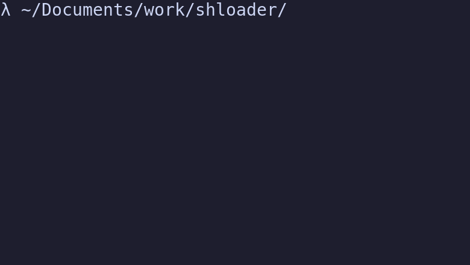

[](https://github.com/Kaderovski)
[](https://choosealicense.com/licenses/mit/)
<p align="center">
    
</p>
<h1 align="center">Shloader</h1>
<p align="center"><i>Shloader is a 100% shell library to display modern loader.</i></p>

## Table of contents

- [Preview](#preview)
- [Installation](#installation)
- [Usage](#usage)
  - [Quick Example](#quick-example)
  - [Long Example](#long-example)
- [Contributors](#contributors)
- [License](#license)

# Preview

<p align="center">
    
</p>

# Features
`shloader` has nice features such as :

😍 emoji support 

💪 emoji loader support

😎 dynamic message on load step

ℹ️ message on step ending

🎨 multiple loading templates

👌 light and easy to use on existing scripts  

# Installation

Nothing to do except copy `./lib/shloader.sh` in your current working directory and source it.

# Usage 

## Quick example
Here is an example you can use on your own :
```shell
source ./lib/shloader.sh

shloader -l emoji_hour -m "Testing" -e "✨ All good !" 

  sleep 2   # remove it in your code
  # … your logic goes here

end_shloader

```

## Long example
```shell
!/bin/bash

# if you want to try just add this block code in your code 
source ./lib/shloader.sh

# you can chose (see more in lib/loader.sh):
# ball, arrow, cym, x_plus, line, ball_wave, npm and old.
# you can specify message to display during loading
# and message to display after your code finished

# eg with npm style
# notice end message -e use unicode emoji to display
# this is for better terminal support
# \u2728 == ✨ but you can use emoji if your settings support it !
shloader -l emoji_face -m "Testing" -e "\u2728 All good !" 
  sleep 2   # remove it in your code

  # … your logic goes here
  # if you want to hide some output from loader
  # don't forget to redirect your STD*
  #
  # eg :
  # STDOUT
  # my_cmd 1> /dev/null
  # STDERR
  # my_cmd 2> /dev/null
  # BOTH
  # my_cmd &> /dev/null

# stop loader
end_shloader
```

## Options

#### Display help

```shell
# e.g
shloader -h
```

| Parameter | Type     | Description                |
| :-------- | :------- | :------------------------- |
| `-h --help` | `none` | Optional. Show help usage |

#### Chose loader

```shell
# e.g
shloader -l arrow
```

| Parameter | Type     | Description                |
| :-------- | :------- | :------------------------- |
| `-l --loader` | `string` | Optional. Chose loader template|

#### Display info on loading

```shell
# e.g
shloader -m "my loading message" 
```

| Parameter | Type     | Description                |
| :-------- | :------- | :------------------------- |
| `-m --message` | `string` | Optional. Show a text message while displaying loader|

#### Display info on ending

```shell
# e.g
shloader -e "\u2728 all done"
```

| Parameter | Type     | Description                |
| :-------- | :------- | :------------------------- |
| `-e --end` | `string` | Optional. Show an end text message when loader ends|

# Contributors

<a href="https://github.com/kaderovski/shloader/graphs/contributors">
  
</a>

# License

[MIT](https://choosealicense.com/licenses/mit/)

